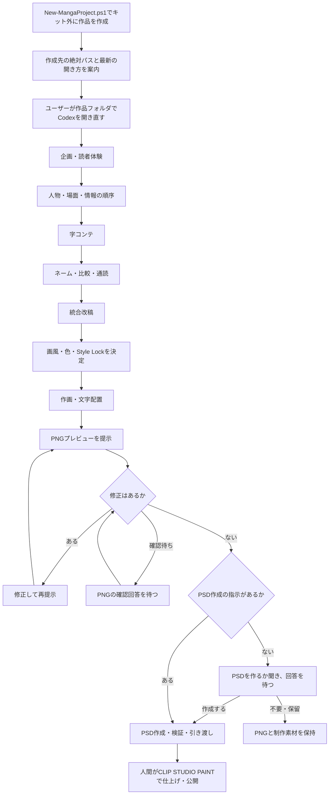

# 漫画制作キット

Codexと一緒に漫画を企画し、字コンテ・ネーム・作画・PNGでの確認を進めるための知識、8つのスキル、作品テンプレートです。

**このフォルダは制作キットの保守・配布用です。漫画は原則ここで描かず、`scripts/New-MangaProject.ps1` でキット外に個別プロジェクトを作成し、そちらでCodexを開き直して制作します。** `templates/manga-project/` は原本なので、直接作品を書き込まないでください。

尚、このリポジトリのURLを ChatGPT Work に指定して漫画のキャラクターやストーリーを指定するだけでも、おおよその機能を利用することができます。

## できること

個別プロジェクトを開いた後、次の制作を進められます。

- 読者体験と物語を設計し、字コンテからネームへ具体化する。
- 物語、没入、映画的演出、読みやすさ、用語、キャラクターの一貫性をレビューする。
- 時代設定・ジャンル・読者層に合わせて画風、白黒/カラー、線、トーン、背景密度を決め、複数ページでStyle Lockを維持する。
- 利用可能な画像生成・編集環境を使って作画し、PNGで確認・修正する。
- 読者年齢に応じて、必要な漢字・固有名詞・特殊な読みへルビを付ける方針を使う。
- PNGの修正がなくなったら、作成指示のあるPSDを作成・検証して引き渡す。
- 動画で演出を試す依頼がある場合に、ローカルComfyUIの生成・回収と動画編集を補助する。

## 制作の流れ



工程ごとの成果物と確認点は[制作プロセス](docs/knowledge/manga/08-workflow-review.md)、画風の決定は[アートディレクション](docs/knowledge/art-direction.md)、ルビは[ルビ・ふりがなの方針](docs/knowledge/ruby-policy.md)、知識と雛形は[ノウハウ一覧](templates/manga-project/docs/MANGA-KNOWHOW.md)にまとめています。「このフォルダで何ができるか」の説明も、個別プロジェクトを作って開き直す流れから始めます。

## はじめ方

Windows PowerShell 5.1以上で、リポジトリのルートから実行します。

```powershell
.\scripts\New-MangaProject.ps1 -ProjectName '作品名' -WhatIf
.\scripts\New-MangaProject.ps1 -ProjectName '作品名'
```

既定の作成先は `../作品名/`。別の親フォルダを使う場合は、キット外に作成される既存の相対パスを `-DestinationParent` で指定します。リポジトリのフォルダ名は自由に変更できます。既存の作品は上書きしません。`-WhatIf` は配置の確認だけで、プロジェクトを作成しません。

作成成功時にスクリプトが**作成先の絶対パス**と、そこでCodexを開き直すメッセージを表示します。Codexが作成した場合も、作成先の実在を確認し、ユーザーへの返信に絶対パスを省略せず示します。これは開き直すための表示であり、文書・設定・保存記録は相対パスを使います。

### 作成したプロジェクトでCodexを開き直す

Codexは作成完了の案内時に、**ChatGPTのWindows用・Mac用アプリでCodexとして開く手順と、VS Codeで開く手順の両方を、その時点の最新の公式情報を調べて説明します**。画面の名称や操作を記憶だけで案内せず、閲覧した出典URLと確認日を添えます。調べ方、案内項目、確認日付きの手順例は[Codexでの開き直し](docs/knowledge/codex-operation.md#作品フォルダでcodexを開き直す)を参照してください。

表示された絶対パスの作品フォルダをアプリまたはVS Codeで開き、そこで新しいCodexの会話を始めます。作成スクリプトの実行だけでは、今の会話の作業フォルダは切り替わりません。作品側の `AGENTS.md`、`project.json`、`docs/PLAN.md`、`docs/PROGRESS.md` を確認してから、`docs/story/BRIEF.md` に狙いを記して制作を始めます。共通知識とスキルは作品側へコピーされ、配布元への実行時依存はありません。既存作品を再開する場合は、新規作成せずその作品フォルダを開きます。

### どうしてもこのキット内で漫画を作る場合の例外

通常は上記の個別プロジェクトを使います。ユーザーがどうしてもキット内で制作したいと明示した場合だけ、次の手順に進みます。

1. ユーザー自身がテキストエディターなどで、このキットのルートに `特別な理由でこのフォルダの中で漫画を作ります.txt` を作成します。拡張子の重複や別名になっていないことを確認してください。
2. Codexはその名前の通常のファイルが実在することを確認します。ファイルがない間は制作を始めません。Codexによる代作・コピー・生成コマンドの実行は行いません。
3. キット内で作るというユーザーの明示指示とファイルの存在がそろったら、例外として制作を始めます。ファイルが置かれているだけでは制作依頼と扱いません。

このファイルは雛形や新規作品へ配布せず、Gitのコミット対象から除外します。例外で作る素材・原稿も公開対象外の `.work/` などに保存し、共通知識・スキル・作品雛形へ混ぜません。キット自体の文書・スクリプトの修正や配布テストには、この例外ファイルは不要です。

## 利用範囲

画像生成ツール、PSDを作成・再読込する手段、CLIP STUDIO PAINT、モデル本体は同梱していません。必要な環境を確認して進める手順を提供します。動画補助処理にはPython 3.10以上、編集にはffmpegとffprobeが必要です。

PSD作成の指示がなければ、PNGでの修正確認後に作るか質問して回答を待ちます。既に指示がある場合は再確認しません。CBZは明示指定時だけ作成します。フィードバックは「残してほしい」と依頼された場合だけ記録し、記録するかの確認はしません。

- [文書の入口](docs/README.md)
- [構成と配布](docs/architecture.md)
- [アートディレクション](docs/knowledge/art-direction.md)
- [ルビ・ふりがなの方針](docs/knowledge/ruby-policy.md)
- [出典と取得日](docs/SOURCES.md)・[映画・脚本資料の参照範囲](docs/knowledge/manga-sources.md)
- [このフォルダからコミットする前の検証](docs/publication.md)
- [利用条件と第三者資料](docs/RIGHTS.md)

現在の配布版は `distribution-version.txt` を参照してください。[作例](examples/README.md)には公開用のPNGと制作条件の説明を収録しています。作例は閲覧用で、新規作品プロジェクトにはコピーしません。
